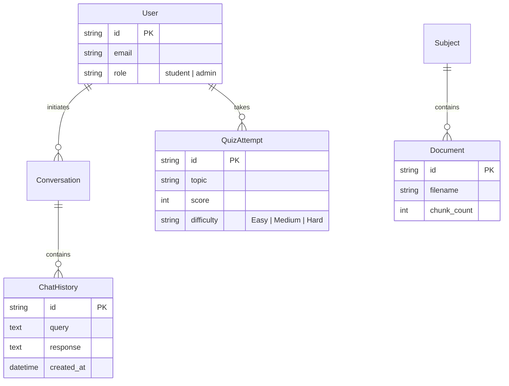

#  Atlas: The Ethereal AI Tutor

[](https://nextjs.org/)
[](https://fastapi.tiangolo.com/)
[](https://www.pinecone.io/)
[](https://cohere.ai/)
[](https://deepmind.google/technologies/gemini/)

Atlas is a state-of-the-art AI Tutoring System that transforms static course curriculums into interactive, 3D visual universes. By combining **Advanced RAG** with **Cross-Encoder Re-ranking**, Atlas provides precise, syllabus-grounded tutoring that adapts to every student's pace.

---

## ✨ Core Superpowers

*   🧠 **Advanced RAG Pipeline**: High-precision retrieval using Gemini embeddings, Pinecone storage, and Cohere Rerank-3 for zero-hallucination tutoring.
*   🌌 **Knowledge Universe**: A breathtaking 3D/2D visualization powered by **Nomic Atlas**. Explore your syllabus as a constellation of connected concepts.
*   📊 **Adaptive Learning Loop**: Personalized quiz generation (Easy/Medium/Hard) that automatically scales based on your real-time performance.
*   🔢 **STEM Optimized**: Built-in LaTeX support renders complex calculus and physics formulas with textbook-quality precision.
*   📝 **Interactive Citations**: Granular, line-level citations displayed as hoverable "curved boxes" that link directly to your source materials.
*   ⚡ **Async Streaming**: Token-by-token streaming via asynchronous SSE for sub-2s initial response engagement.

---

## 🏗️ Database Architecture

Atlas uses a robust relational schema to track your learning journey.



---

## 🛠️ Getting Started

### 1. Prerequisites
Ensure you have Python 3.10+ and Node.js 18+ installed.

### 2. Environment Configuration
Create a `.env` file in the `backend/` directory with the following:
```env
GEMINI_API_KEY=your_key
PINECONE_API_KEY=your_key
PINECONE_INDEX_NAME=atlas-tutor
COHERE_API_KEY=your_key
NOMIC_API_KEY=your_key
```

### 3. Backend Setup & Migrations
```bash
cd backend
# Create virtual environment
python -m venv venv
source venv/bin/activate # Windows: venv\Scripts\activate

# Install dependencies
pip install -r requirements.txt

# Run database migrations
alembic upgrade head

# Start the engine
python -m uvicorn app.main:app --reload
```

### 4. Frontend Setup
```bash
cd frontend
npm install
npm run dev
```
Open [http://localhost:3000](http://localhost:3000) to enter the Archive.

---

## 📈 Performance KPIs

| Metric | Target | Status |
| :--- | :--- | :--- |
| **Initial Latency (TTFT)** | < 2.0s | ✅ Optimized |
| **Retrieval Depth** | Top 20 Candidates | ✅ Implemented |
| **Rerank Accuracy** | Cohere Rerank-3 | ✅ Integrated |
| **Response Faithfulness** | LLM-as-a-Judge (GPT-4/Gemini) | ✅ Monitored |

---

## 📜 Roadmap & Final Deliverables
- [x] Document Ingestion & Chunking
- [x] Pinecone Vector Integration
- [x] Cohere Cross-Encoder Reranking
- [x] Adaptive Quiz Difficulty Loop
- [x] Nomic Atlas Knowledge Mapping
- [x] Interactive LaTeX Math Rendering
